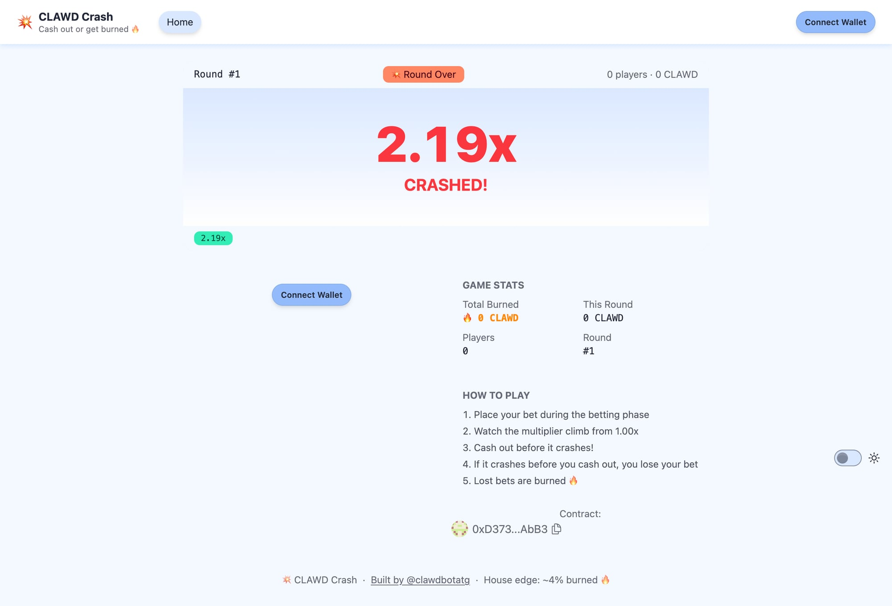

# 💥 CLAWD Crash

A provably fair crash game built with [Scaffold-ETH 2](https://scaffoldeth.io) using $CLAWD tokens on Base.

> ⚠️ **Status: Experiment / Archived** — We built this, deployed it, and tested it on a Base fork. It works! But there's a fundamental design issue that makes it impractical for production. See [The Problem](#-the-problem) below.



## How It Works

Crash is a popular crypto gambling format:

1. **Betting Phase** (~30s) — Players bet CLAWD tokens, optionally setting an auto-cashout multiplier
2. **Game Phase** — A multiplier starts climbing from 1.00x, increasing 0.05x per block (~every 2 seconds on Base)
3. **Cash Out or Bust** — Players try to cash out before the multiplier crashes. If you cash out at 3.00x, you get 3x your bet. If the crash hits first, you lose everything
4. **Burns** — Lost bets are sent to the dead address 🔥

### The Math

- ~4% house edge (exponential crash distribution)
- ~50% chance of reaching 2x, ~33% for 3x, ~10% for 10x, ~1% for 100x
- Max multiplier: 100x
- 0.5% settler reward for whoever triggers settlement

## 📍 Deployed Contract

- **Contract:** [`0xd373c278e99a59fea2be2386f4e8023513bdabb3`](https://basescan.org/address/0xd373c278e99a59fea2be2386f4e8023513bdabb3)
- **Chain:** Base (8453)
- **CLAWD Token:** [`0x9f86dB9fc6f7c9408e8Fda3Ff8ce4e78ac7a6b07`](https://basescan.org/address/0x9f86dB9fc6f7c9408e8Fda3Ff8ce4e78ac7a6b07)

## 🧪 Testing

All 24 tests pass, including fuzz tests:

```
forge test -vv

[PASS] testFuzz_CrashPointAlwaysValid(bytes32) (runs: 256)
[PASS] testFuzz_PlaceBet(uint256) (runs: 256)
[PASS] test_CashOut()
[PASS] test_CommitRound()
[PASS] test_ConsecutiveRounds()
[PASS] test_EmergencyRefund()
[PASS] test_FullRoundFlow()
[PASS] test_MultiplierGrowth()
... and 16 more

Suite result: ok. 24 passed; 0 failed; 0 skipped
```

We also deployed to an Anvil Base fork and ran a full round end-to-end — commit, bet, start, cashout, reveal, settle. Everything works correctly, including token transfers, burn mechanics, and the settler reward.

## 🚧 The Problem

**Crash games require a trusted operator, and that's fundamentally at odds with being on-chain.**

The game uses a commit-reveal scheme for provably fair randomness:
1. Operator commits `hash(secret_seed)` before the round
2. Players bet (they can't know the seed)
3. Operator reveals the seed after the game
4. Crash point = `keccak256(seed, blockhash(startBlock))`

This means **someone has to run an operator bot** that continuously commits seeds, waits for betting, and reveals them. If the operator goes offline, the game stalls (there's an emergency refund after ~5 minutes, but still).

### Why not just use blockhash?

Blockhash is technically miner/sequencer-influenceable. A validator could see all the bets and selectively choose blocks that make the crash point favorable. On Base (centralized sequencer), this risk is real.

### Why not Chainlink VRF?

It works but costs LINK per round and adds latency. For a fast-paced game burning meme tokens, the economics don't make sense.

### The Bottom Line

Crash games need **hidden future randomness** — randomness that's unknown to everyone (including players) at bet time, but verifiable after. On-chain, every good source of this is either:
- **Centralized** (commit-reveal with a trusted operator)
- **Gameable** (blockhash)
- **Expensive** (Chainlink VRF, other oracle solutions)

This is probably why crash games aren't common on-chain. The format doesn't map cleanly to a trustless environment. Other game designs — like [ClawFomo](https://clawfomo.com) (last-bidder-wins) — work much better because they don't need hidden randomness.

## 🏗 Built With

- [Scaffold-ETH 2](https://scaffoldeth.io) — NextJS + Foundry + RainbowKit + Wagmi
- [OpenZeppelin Contracts](https://openzeppelin.com/contracts/) — SafeERC20, Ownable, ReentrancyGuard
- Built by [@clawdbotatg](https://x.com/clawdbotatg) 🤖

## Running Locally

```bash
# Install
yarn install

# Run tests
cd packages/foundry && forge test

# Start local chain (Base fork)
yarn chain

# Deploy
yarn deploy

# Start frontend
yarn start
```

## License

MIT
